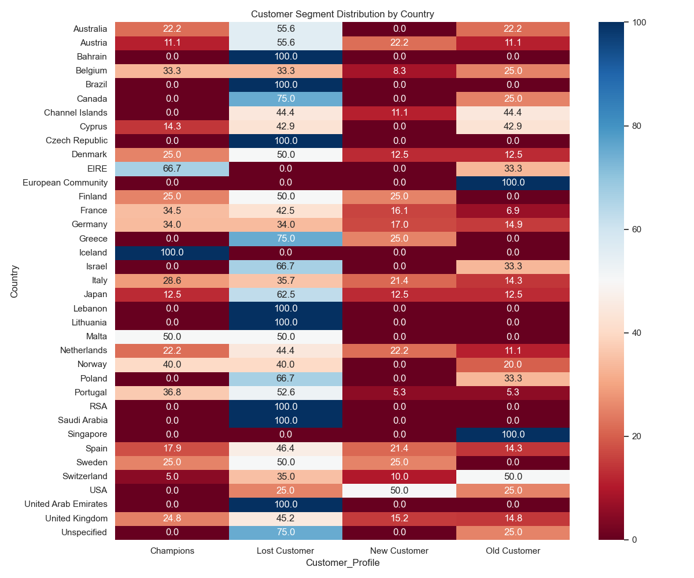

RFM Customer Segmentation & Marketing Strategy Analysis

Project Overview

This project focuses on customer segmentation using RFM (Recency, Frequency, Monetary) analysis on real-world retail transaction data.
The objective is to understand customer purchasing behavior and design data-driven marketing campaign strategies.

Rather than only segmenting customers, this project translates behavioral insights into actionable business decisions.

Business Problem

Companies interact with customers who exhibit different purchasing patterns and value levels. Applying the same marketing strategy to all customers leads to inefficient resource allocation.

This project aims to:

Identify customer value differences

Detect loyalty patterns

Design personalized marketing campaigns

Support retention and revenue optimization strategies

Dataset

Dataset: Online Retail Dataset (Real-world anonymized transactional data)

The dataset contains retail transactions from an online UK-based store and includes customer purchases across multiple countries.

Key Variables
Variable	Description
CustomerID	Unique customer identifier
InvoiceDate	Transaction date
Quantity	Number of purchased items
UnitPrice	Price per product
Country	Customer location
Methodology

The analysis follows an end-to-end customer analytics workflow.

1. Data Preparation

Missing customer IDs removed

Product returns filtered (negative quantities)

Transaction value calculated (BasketPrice)

2. Customer Aggregation

Transactions aggregated at customer level:

Monetary → Total spending

Frequency → Purchase count

Recency Proxy → Last purchase date

3. RFM Scoring

Customers were scored using quantile-based segmentation:

R Score (Recency)

F Score (Frequency)

M Score (Monetary)

Scores range from 1–5.

4. Customer Segmentation

Customers were grouped into behavioral profiles:

Segment	Description
Champions	Active and highly loyal customers
New Customers	Recently acquired customers
Old Customers	Previously loyal but less recent
Lost Customers	Low engagement customers
Segment Insights
Revenue Contribution by Segment

Customer segments contribute differently to overall revenue.

Key observation:

High-value segments generate disproportionate revenue compared to their population size.

Geographic Customer Structure

Customer loyalty varies significantly across countries.

A heatmap analysis shows:

Some markets contain higher Champion ratios

Others show higher churn risk (Lost Customers)

This indicates marketing strategies should be localized by region.

Revenue Contribution by Country

Revenue is concentrated in specific geographic markets, highlighting core business regions.

Customer Loyalty Intensity

Average purchase frequency differs across countries, revealing varying engagement levels.

Marketing Campaign Strategy

Instead of stopping at segmentation, tailored campaigns were assigned:

Segment	Campaign Strategy
Champions	VIP benefits and loyalty rewards
New Customers	Onboarding and welcome offers
Old Customers	Re-engagement incentives
Lost Customers	Strong win-back campaigns

This transforms analysis into a decision-support framework.

Visual Insights

The project includes:

Segment distribution heatmap

Revenue contribution analysis

Loyalty intensity comparison

Geographic customer behavior visualization

Key Business Takeaways

Customer value is highly unevenly distributed.

Loyalty patterns vary across markets.

Personalized campaigns improve marketing efficiency.

Data-driven segmentation enables targeted growth strategies.

Technologies Used

Python

Pandas

Seaborn

Matplotlib

Project Outcome

This project demonstrates how transactional data can be transformed into:

Customer intelligence

Marketing strategy recommendations

Actionable segmentation insights

Author

Developed as a customer analytics case study focusing on business-oriented data analysis and marketing applications.

## Data Source

The dataset used in this project is the **Online Retail Dataset**, publicly available on Kaggle:

https://www.kaggle.com/datasets/vijayuv/onlineretail

The dataset contains anonymized transactional records from a UK-based online retail store.
